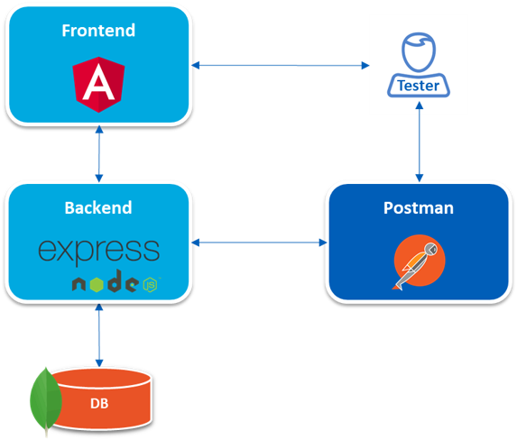
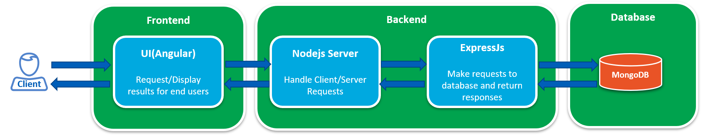

# MEAN-Website-Backend
Backend application written using MEAN stack.

Frontend application is written in MEAN-Website-Frontend repo.

# Architecture


Above picture describes how the applications are positioned. This is high level flow.

Testing is done manually using postman for backend application and manually via UI for frontend application. Postman is used to trigger webservice calls. The tests can be automated using Robot framework's requests and ui testing libraries.



This picture describes the sequence of the calls, this is low level design for this complete application, this repo only consist of backend side, along with mongoDb setup scipts. 


# Lets setup the environment
- First go here — https://nodejs.org/en/download/ and Install NodeJS.
- Download and Install MongoDB — https://www.mongodb.com/download-center#community
- Download a good Text Editor or IDE. I Personally prefer Visual Studio Code — https://code.visualstudio.com/download


Now the environment Setup is done. Let’s get into the command line.

First we need to install ExpressJS. The most popular NodeJS Framework.

```
npm install -g express express-generator
```

This will install ExpressJS and the ExpressJS Official generator packages. Now let’s generate the Application using the Express Generator.

```
express --view=ejs todoapp
```

Now the express App is generated. Go inside the directory.

````
cd todoapp
npm install
````
All the necessary packages will be installed.
At first let’s install all the necessary packages we will be using throughout this app.

````
npm install --save bluebird mongoose mongoose-paginate nodemon
````

# Reference
https://medium.com/netscape/mean-app-tutorial-with-angular-4-part-1-18691663ea96

# todo-api
A simple todo API made with NodeJS, ExpressJS and MongoDB. Can be used as a back-end for learning front-end technologies without making a standalone API for that purpose.


## Download Instruction

Run `git clone https://github.com/nomanHasan/todo-api` to download the project to your computer.


## Database Setup

Download and isntall MogoDB.
Make sure that the database is running at `127.0.0.1:27017`


## Project Setup

Now run `cd todo-api` to go inside the directory

Run `npm install` to install all the dependencies.

Run `npm install -g nodemon` to install Nodemon Globally.

Run `npm start` to run the NodeJS Server.